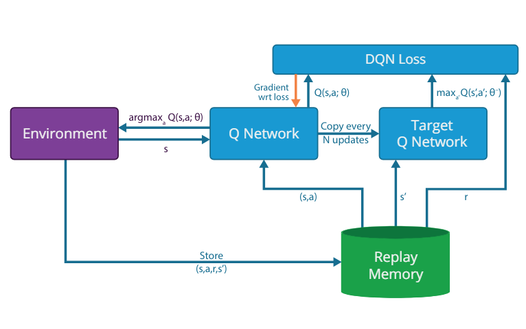
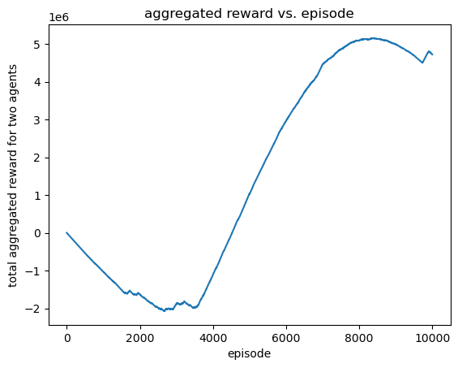
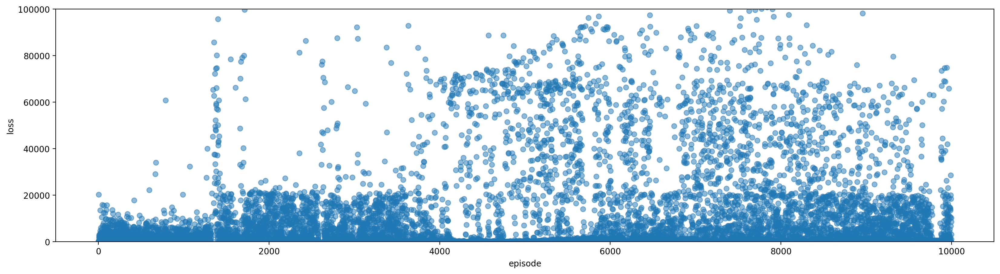

# DS-301-RL-on-Games
DS-301 final project on reinforcement learning on tactic shooting simulation

## Description
The project aims to train double agents in deep reinforcement learning with DQN to perform tactical shooting tasks in 2D and 3D simulation environments built with OpenAI Gym.

## Getting Started

### Dependency
  * python >= 3.9
  * numpy
  * pyparsing
  * scikit-image
  * nvidia cudatoolkit=11.3
  * pytorch
  * torchvision
  * torchaudio
  * OpenAI gym

### Project Structure
This Project has 2 main parts:
- The train folder to train DQN agents in our 3D and 2D environments:
    - Within `train/Env/env.py` is where all the environment classes are stored
    - Within `train/agent/agent.py` is where we have the DQN Neural Network class and the DQAgent which is where the Neural Network is implemented to have replay and memory
    - Within `train/agent/schedule.py` is where the hyperparameter scheduling schemes were specified
- The notebooks folder which contains all the notebooks where all the tests, tuning, and prototyping were done for this project

### Executing program
* Edit `train/cfgs/config.yml` to set hyperparameters
* Run `train/train.py` to start training

## Model Information

### Architecture

A fully functioning Deep Q-Network that contains
 * Dual Q-networks
 * Two agents
 * Experience replay
 * Customized 3D environment
 * Greedy epsilon scheduler

### Evaluation
We collected the data manually by modifying the `train/train.py` to compute rewards and losses in our training process. The aggregate reward earned by these agents is shown below.

The loss plot can be used to inspect how well the model is approximating the target Q-value

###Demonstrations:

https://github.com/kingsagerage/DS-301-RL-on-Games/blob/main/notebooks/Output/environment_video.mp4

## Conclusion
Training intelligent agents for tactical shooting simulations proved both challenging and
insightful. We constructed a rich 3D environment and successfully implemented a Deep
Q-learning Network (DQN) enabling agents to learn complex behaviors of micmicing a
first person shooting experience. The DQN achieved a reasonable q map that helps the
agent to do the right action. Our analysis identified key factors influencing agent
behavior, model convergence, and the impact of training settings. These were true in
both the 2D and 3D settings. Changing different hyper-parameters, starting positions,
and adding memory and replay drastically affected the outcome.\
\

However, there are several limitations. Convergence times and model performance are
highly dependent on starting positions in each epoch, highlighting the sensitivity of
training outcomes to initial conditions. Additionally, while agents excelled at eliminating
nearby targets, they occasionally fixated on these objectives, neglecting long-term
strategic goals.\
\
Addressing these limitations is crucial for future development. Exploring alternative
reward structures that incentives strategic decision-making and investigating methods for
enhanced training stability across diverse environments are further research directions.
Overall, our project has a strong foundation for developing intelligent agents capable of
complex tactical maneuvers in simulated scenarios, paving the way for advancements in
tactical gaming applications

## Authors

* Sage Harley [snh362@nyu.edu](https://github.com/kingsagerage)
* William Huang [xw2559@nyu.edu](https://github.com/wang3ng)
* Charles Zhang [sz3583@nyu.edu](https://github.com/1295212083)

## Reference
* [Playing Atari with Deep Reinforcement Learning](https://arxiv.org/pdf/1312.5602)
* [Massively Parallel Methods for Deep Reinforcement Learning](https://arxiv.org/pdf/1507.04296)
* [OpenAI Gymnasium](https://gymnasium.farama.org/#)

  

    

